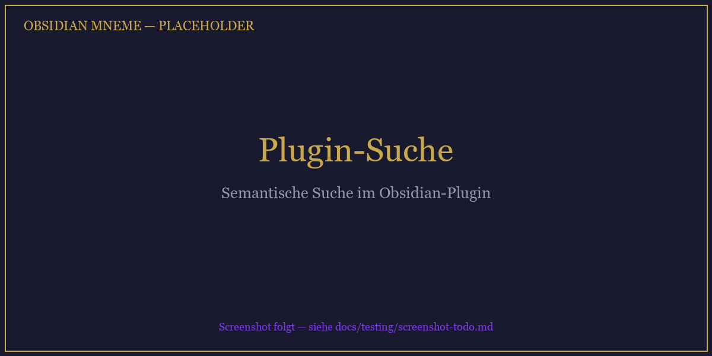
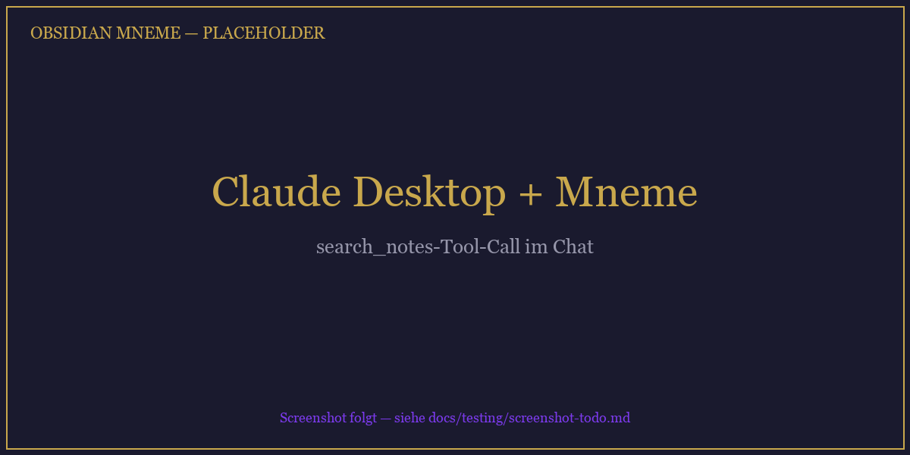
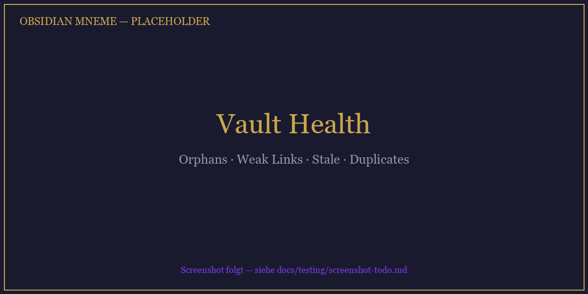

<p align="center">
  
</p>

# Obsidian Mneme


**Semantische Vault-Suche für Obsidian — komplett lokal, keine API-Keys, keine Cloud.**

Obsidian Mneme indexiert deine Markdown-Notizen mit BGE-M3 und macht sie auf drei Wegen nutzbar: **als Suche direkt in Obsidian** (kein LLM nötig), **als Wissensquelle für Claude Desktop / Claude Code / Cursor** via MCP, oder **über eine CLI** für Scripts. Dein Vault bleibt auf deinem Rechner.

> **Not to be confused with** [`mneme-cli`](https://pypi.org/project/mneme-cli/) by [@tolism](https://github.com/tolism/mneme) — that's an unrelated regulatory QMS tool for medical-device compliance. This project is a semantic-search MCP server for personal Obsidian vaults. PyPI package name: **`obsidian-mneme`**.

*Der Name: **Mneme** (altgriechisch Μνήμη, "Erinnerung") war eine der drei ursprünglichen Musen — Personifikation des Gedächtnisses.*

---

## Was bringt dir das?

**Das Problem mit Obsidians Standard-Suche:** Sie findet nur Notizen, in denen genau deine Such-Wörter stehen. Du hast vor Monaten "Retrieval Augmented Generation" notiert und suchst heute nach "RAG" — keine Treffer. Du hast "Coroutinen" geschrieben, suchst nach "async" — nichts.

**Mit Mneme:** Suche nach Bedeutung, nicht nach Buchstaben.

### 🔍 Direkt in Obsidian — kein LLM nötig

Ribbon-Icon klicken, Query tippen. Das Plugin liefert Treffer nach Bedeutung:

- Query *"RAG"* → findet Notizen über Retrieval Augmented Generation, Vector-Suche, Embedding-Strategien
- Query *"schnelle Entscheidungen treffen"* → findet deine Notizen über Pre-Mortems, Regret-Minimization, 10-10-10-Regel
- Query *"warum Tests schreiben"* → findet Notizen über TDD, Regression-Schutz, Refactoring-Safety

Offen eine Notiz, Tab auf "Ähnliche Notizen" wechseln → zeigt deine semantischen Nachbarn, nicht nur Wikilinks.



### 🤖 Mit Claude / Cursor / Continue — dein Vault wird Teil der Konversation

Claude kennt dein Allgemein-Wissen, aber nicht dein persönliches. Mit Mneme fragt Claude automatisch deinen Vault ab, bevor er antwortet:

- *"Erklär mir nochmal mein Setup für das Projekt X"* → Claude zieht deine Projekt-Notizen und baut darauf auf, statt aus dem Nichts zu halluzinieren
- *"Welche Learnings habe ich über Prompt-Engineering gesammelt?"* → Cross-Project-Recherche über alle deine KI-Notizen
- *"Analysiere meinen Trading-Ansatz vor dem Hintergrund der aktuellen Marktlage"* → Claude kombiniert deine Strategie-Notizen mit seinem Markt-Wissen
- *"Was hab ich letzten Monat über Thema Y festgehalten?"* → findet die Notiz, auch wenn du andere Wörter verwendet hast



### 🌱 Vault-Management

Das Plugin bietet ein Vault-Health-Modal:

- **Orphan Pages** — Notizen, die nirgends verlinkt sind (kandidaten fürs Aufräumen)
- **Weak Links** — Notizen mit wenigen Verbindungen + semantisch passenden Vorschlägen
- **Stale Notes** — Notizen, die als `status: aktiv` markiert aber seit >30 Tagen unangefasst sind
- **Near Duplicates** — inhaltlich fast identische Notizen



---

## Drei Wege, das zu nutzen

1. **Direkt in Obsidian** (Plugin, kein LLM) — Search-Sidebar, Similar-Notes, Vault-Health
2. **Mit Claude Desktop / Claude Code / Cursor / jedem MCP-Client** — Claude fragt, Mneme liefert Notizen als Kontext
3. **Von der CLI** — `mneme search "query"` für Scripts und Automation

Alle drei nutzen denselben Server, denselben Index, denselben Vault.

---

## Für wen ist das?

- **Obsidian-Poweruser** mit 50+ Notizen, die mehr wollen als exakte Wort-Matches — Plugin reicht, kein LLM nötig
- **Claude- / Cursor- / Continue-User**, die ihren Vault in LLM-Sessions nutzen wollen
- **Privacy-bewusste** Menschen — alles lokal, keine Cloud, keine API-Keys, keine Telemetrie
- **Entwickler**, die einen lokalen RAG-Sidecar brauchen (kein LLM-Frontend)

**Obsidian Mneme ist nicht:** ein Chat-UI, ein LLM-Frontend, ein Zettelkasten-Ersatz oder eine Cloud-SaaS-Alternative.

---

## Getting Started

Voraussetzungen einmalig für alle drei Modi:

```bash
pip install obsidian-mneme         # in einem dedizierten venv!
mneme setup                         # Wizard: Vault-Pfad, Transport (http empfohlen)
```

> ⚠️ **Disk + Bandbreite beim ersten Lauf:** ~1 GB Python-Pakete + ~2 GB BGE-M3-Modell.
> CPU-Erstindex auf 200 Notizen: 15-25 Min mit sichtbarer Progress-Bar. Danach: <10s pro Reindex, ~600 ms pro Query.

> ⚠️ **Nutze immer ein dediziertes venv** (`python -m venv .venv` oder `uv venv`). `pip install obsidian-mneme` zieht CPU-torch — wenn du schon CUDA/ROCm-torch drin hast, wird's überschrieben. Details siehe [GPU-Support](#gpu-support-optional).

Danach entscheide welchen Modus du willst:

### 🔍 Nur Obsidian-Plugin (kein LLM)

**Am einfachsten.** Das Plugin startet den Mneme-Server automatisch beim Obsidian-Öffnen.

1. **Server-Binary-Pfad merken:** `mneme --version` ausführen, dann unter Windows `where mneme` / macOS+Linux `which mneme`. Merke dir den absoluten Pfad (z.B. `C:\Users\You\.venv\Scripts\mneme.exe`).
2. **Plugin installieren:** [Latest Release](https://github.com/MakaveliGER/obsidian-mneme/releases) herunterladen — `main.js`, `manifest.json`, `styles.css` nach `<vault>/.obsidian/plugins/mneme/` kopieren.
3. **Plugin aktivieren:** Obsidian → Settings → Community Plugins → Mneme an.
4. **Pfad eintragen:** Settings → Mneme → "Mneme Pfad" auf den Binary-Pfad aus Schritt 1. Auto-Start an (Default).
5. **Obsidian neu laden** (Ctrl+P → "Reload app without saving"). Beim ersten Start lädt der Server das Modell (10-15 s, Notice oben rechts: *"HTTP-Fast-Path aktiv (Port 8765)"*).

**Jetzt suchen:** Ribbon-Icon (goldene Muse) klicken → Sidebar öffnet sich → Query tippen → Ergebnisse in ~30 ms. Wechsel zum "Ähnliche Notizen"-Tab zeigt semantische Nachbarn der aktuell offenen Notiz.

### 🤖 Claude Desktop (mit oder ohne Plugin)

Voraussetzung: HTTP-Server läuft. Entweder:
- **Plugin übernimmt Serverstart** — oben Schritt 1-5, dann ist der Server immer an wenn Obsidian auf ist.
- **Oder manuell:** `mneme serve --transport streamable-http` in einem Terminal (alternativ als Windows-Autostart, siehe unten).

Dann in `claude_desktop_config.json`:
- Windows: `%APPDATA%\Claude\claude_desktop_config.json`
- macOS: `~/Library/Application Support/Claude/claude_desktop_config.json`

```json
{
  "mcpServers": {
    "mneme": {
      "type": "http",
      "url": "http://127.0.0.1:8765/mcp"
    }
  }
}
```

**Claude Desktop komplett beenden** (System-Tray → Quit, nicht nur Fenster schließen) und neu starten. In einem neuen Chat sollte Mneme als Tool-Provider gelistet sein. Frag: *"Fass mir meine letzten Notizen über Thema XY zusammen"* — Claude nutzt `search_notes` automatisch.

### ⌨️ Claude Code (Terminal-CLI)

Für Terminal-Sessions: `.claude/mcp.json` im Vault- oder Projekt-Ordner:

```json
{
  "mcpServers": {
    "mneme": {
      "command": "mneme",
      "args": ["serve"]
    }
  }
}
```

stdio-Transport reicht hier — der Server wird pro Session gespawnt.

> ⚠️ **Cold-Start-Warning für Claude Code auf Windows:** torch-Import in Electron-Kind-Prozessen via stdio kann 60-190s hängen. Workaround: den HTTP-Server parallel laufen lassen und in `.claude/mcp.json` auf `"type": "http"` + `"url"` umstellen (wie bei Claude Desktop).

---

## Features

- 🔒 **Zero Cloud** — alles lokal (CPU oder GPU), keine API-Keys, keine Telemetrie, kein externer Service
- 🔍 **Hybrid Search** — Vector (BGE-M3, 1024-dim, multilingual) + BM25 mit Reciprocal Rank Fusion
- 🧠 **GraphRAG** — Wikilink-Graph-Traversal für kontextuelle Nachbar-Notizen
- 🛠 **8 MCP-Tools** — `search_notes`, `get_similar`, `get_note_context`, `vault_stats`, `vault_health`, `reindex`, `get_config`, `update_config`
- 🌐 **Zwei Transport-Modi** — `stdio` für Claude Code, `streamable-http` für Claude Desktop (persistent, Model pre-warmed)
- 📊 **Vault Health** — findet Orphans, schwache Links, Stale Notes, Duplikate
- 👀 **File Watcher** — Änderungen im Vault → automatische Re-Indexierung (mit Bulk-Coalescing)
- 🔌 **Obsidian-Plugin** — Such-Sidebar, Health-Modal, Status-Bar, Auto-Start des HTTP-Servers
- 🚀 **Optional: GPU** — bis zu 87× Speedup mit ROCm/CUDA
- 🧪 **Reranking + GARS-Scoring** — opt-in, bei <500 Notizen aktuell schädlich (siehe `docs/`)

---

## Zusatz-Themen

**Plugin aus dem Source bauen** (nur wenn du selbst Änderungen machst):

```bash
cd obsidian-plugin
npm install
npm run build
# → main.js, manifest.json, styles.css nach <vault>/.obsidian/plugins/mneme/ kopieren
```

> Plugin-Submission an den Obsidian Community Store kommt in einem späteren Release.

**Windows-Autostart** (Server läuft beim Login im Hintergrund, kein Obsidian-Start nötig):

```powershell
pwsh -File scripts/install-autostart-windows.ps1
# Deinstallieren:
pwsh -File scripts/uninstall-autostart-windows.ps1
```

Der Task startet `pythonw.exe -m mneme.cli serve --transport streamable-http` (kein Konsolen-Fenster).

---

## Setup-Wizard

`mneme setup` (oder `mneme init`):

1. **Vault-Pfad** — absoluter Pfad zum Obsidian-Vault-Ordner (Beispiel: `C:\Users\You\Documents\MyVault`)
2. **Embedding-Modell** — Default `BAAI/bge-m3` (multilingual, 1024-dim, ~2 GB)
3. **Transport** — `stdio` (Default für Claude Code) oder `streamable-http` (empfohlen für Claude Desktop)
4. **Initialer Index** — läuft durch mit Progress-Bar (CPU: 15-25 Min bei 200 Notizen, GPU: <30s)

Am Ende kriegst du einen auf deinen Transport zugeschnittenen "So geht's weiter"-Hinweis.

**Version prüfen:** `mneme --version`

---

## GPU-Support (optional)

Mneme nutzt PyTorch. Für Beschleunigung **separat** installieren:

| Plattform | Befehl |
|---|---|
| NVIDIA CUDA | `pip install torch --index-url https://download.pytorch.org/whl/cu124` |
| AMD ROCm (Linux) | siehe [PyTorch ROCm](https://pytorch.org/get-started/locally/) |
| AMD ROCm (Windows) | HIP SDK + spezielle Wheels von `repo.radeon.com/rocm/windows/` |

Dann: `mneme update-config embedding.device cuda` (oder `auto`).

**Gemessen:** 87× Speedup mit RX 7900 XTX (float16, 152 Notizen, 11.9s vs 1029s CPU).

---

## Lean-Install: `raw-transformers`

Alternative zum `sentence-transformers`-Provider — nutzt direkt `transformers.AutoModel`, spart die sklearn + scipy Dependency (~70 MB). Gleiche BGE-M3-Embeddings, nur ohne Extra-Imports.

```bash
mneme update-config embedding.provider raw-transformers
```

Oder direkt in `config.toml`:

```toml
[embedding]
provider = "raw-transformers"
```

Lohnt sich wenn du kein Reranking brauchst (Default: aus) und kleinere Disk/Cold-Start-Werte willst. `sentence-transformers` bleibt der Default.

---

## Transport-Modi

| Modus | Wann? | Wie starten? |
|---|---|---|
| **`streamable-http`** | Claude Desktop, Obsidian-Plugin, mehrere Clients gleichzeitig | `mneme serve --transport streamable-http` |
| **`stdio`** | Claude Code / `.claude/mcp.json`-Workflows | `mneme serve` (Default) |

HTTP-Server lauscht auf `http://127.0.0.1:8765/mcp`, Model ist beim Start bereits geladen. Port/Host via Flag oder Config änderbar.

**Health-Check:**

```bash
curl http://127.0.0.1:8765/health
# {"status":"ok","model_loaded":true}
```

---

## Environment-Variablen

| Variable | Zweck |
|---|---|
| `MNEME_DEBUG=1` | Aktiviert volle Tracebacks, Heartbeat-Logs, Faulthandler-Stack-Dumps |
| `MNEME_ALLOW_NETWORK=1` | Lässt HF-Hub Netzwerk-Zugriff zu (erstes Modell-Download oder Cache-Refresh) |
| `MNEME_ALLOW_NONLOOPBACK=1` | Erlaubt HTTP-Bind auf `0.0.0.0` oder andere Nicht-Loopback-Hosts (**Vault ohne Auth exponiert — nur bewusst nutzen**) |
| `HF_HOME` | Überschreibt den HuggingFace-Cache-Pfad |
| `HF_HUB_ENABLE_HF_TRANSFER=0` | Deaktiviert beschleunigte HF-Downloads (hinter Proxys manchmal nötig) |
| `MNEME_<SECTION>__<KEY>` | Beliebige Config-Felder per Env (siehe `.env.example`) |

---

## CLI-Reference

| Command | Zweck |
|---|---|
| `mneme --version` | Version anzeigen |
| `mneme setup` / `mneme init` | Interaktiver Setup-Wizard |
| `mneme serve` | MCP-Server starten (Transport aus Config) |
| `mneme serve --transport streamable-http` | HTTP-Server explizit |
| `mneme serve --port 9000 --host 127.0.0.1` | Port/Host-Override |
| `mneme search <query>` | CLI-Suche, JSON-Output |
| `mneme similar <path>` | Semantisch ähnliche Notizen |
| `mneme reindex` | Inkrementelle Re-Indexierung |
| `mneme reindex --full` | Vollständig (auch Schema-Migration) |
| `mneme status` | Index-Statistiken |
| `mneme health` | Vault-Diagnose |
| `mneme get-config` | Aktuelle Config als JSON |
| `mneme update-config <key> <value>` | Einzelnen Wert setzen |
| `mneme auto-search off/smart/always` | Auto-Search-Modus für Claude Code |
| `mneme install-hooks` | Claude-Code-Hooks installieren |
| `mneme eval` | Retrieval-Qualität gegen Golden-Dataset messen |

---

## Configuration

`config.toml` (Pfad via `mneme get-config`, typischerweise `%APPDATA%\mneme\config.toml` unter Windows):

```toml
[vault]
path = "/path/to/vault"
exclude_patterns = []  # glob, z.B. ["Newsletter/**", ".trash/**"]

[embedding]
provider = "sentence-transformers"   # oder "raw-transformers" / "onnx"
model = "BAAI/bge-m3"
device = "auto"                       # "auto" | "cpu" | "cuda"
dtype = "float16"                     # float16 (GPU) | bfloat16 (CPU) | float32
batch_size = 32

[server]
transport = "streamable-http"         # oder "stdio"
host = "127.0.0.1"
port = 8765

[search]
vector_weight = 0.6
bm25_weight = 0.4
top_k = 10

[reranking]
enabled = false
threshold = 0.3

[scoring]
gars_enabled = false
graph_weight = 0.3

[auto_search]
mode = "smart"                        # off | smart | always
```

Alle Werte auch per `mneme update-config <key> <value>` setzbar (mit Range-Validierung).

---

## FAQ

**Sendet Mneme meine Notizen an jemanden?**
Nein. Das Modell läuft lokal, der Server bindet auf `127.0.0.1`. Default ist offline (`HF_HUB_OFFLINE=1`). Einzige Netzwerk-Aktivität: HF-Hub-Download des Modells beim allerersten Lauf — danach ist alles im lokalen Cache (`HF_HOME`).

**Funktioniert Mneme ohne GPU?**
Ja. CPU reicht für den täglichen Gebrauch. Erstindex ist halt länger (15-25 Min für 200 Notizen, vs. <30s mit GPU). Queries sind mit CPU ~200-500 ms, mit GPU ~600 ms auf 5000+ Notizen.

**Was passiert wenn ich eine Notiz umbenenne?**
File-Watcher sieht's, Indexer behandelt's als delete + re-add (behält aber die DB-row-id konsistent, Wikilinks werden neu aufgelöst). Bulk-Umbenennungen (z.B. via Obsidian-Refactor): automatisches Batching.

**Kann ich Mneme für zwei Vaults parallel nutzen?**
Aktuell: ein Config-File = ein Vault. Workaround: zwei venvs mit unterschiedlichen Config-Pfaden (via `MNEME_CONFIG_PATH` env) und unterschiedlichen Ports. Multi-Vault-Support ist nicht geplant.

**Warum BGE-M3 und nicht OpenAI-Embeddings?**
BGE-M3 ist MIT-lizenziert, multilingual (inkl. Deutsch), 1024-dim, Top-Performance bei Retrieval. Keine API-Abhängigkeit, keine Kosten, kein Datenabfluss.

**Ich hatte schon torch installiert — mneme hat es überschrieben!**
Ja, das passiert wenn du in dieselbe venv `pip install obsidian-mneme` machst und torch in einer CUDA/ROCm-Variante hattest. Lösung: dediziertes venv. Siehe [GPU-Support](#gpu-support-optional).

**Claude Desktop findet keine Mneme-Tools.**
(1) Läuft der HTTP-Server? `curl http://127.0.0.1:8765/health` — muss `"status":"ok"` liefern. (2) `claude_desktop_config.json` am richtigen Ort? Windows: `%APPDATA%\Claude\`, macOS: `~/Library/Application Support/Claude/`. (3) Claude Desktop **komplett beendet** (System-Tray → Quit, nicht nur Fenster zu)?

**Port 8765 ist belegt.**
`mneme serve --port 9000` und `config.toml` oder `mcp.json` entsprechend anpassen. Mneme prüft den Port vor dem Binden und gibt eine klare Fehlermeldung.

---

## Troubleshooting

| Fehler | Ursache | Fix |
|---|---|---|
| `MnemeSchemaError: Legacy DB detected` | DB mit älterer Mneme-Version gebaut | `mneme reindex --full` |
| `Failed to load sqlite-vec extension` | sqlite-vec Binary fehlt | `pip install --force-reinstall sqlite-vec` |
| `Mneme nicht gefunden: "mneme"` (Plugin) | Binary nicht im PATH | Plugin-Settings → `mnemePath` auf vollen Pfad setzen |
| `refusing to bind to '0.0.0.0'` | Non-Loopback ohne Override | `MNEME_ALLOW_NONLOOPBACK=1` setzen — **nur wenn du weißt was du tust** |
| `port 8765 is already in use` | Anderer Prozess auf dem Port | `mneme serve --port 9000` + Config anpassen |
| Modell-Download hängt | Proxy / HF-Hub offline | `MNEME_ALLOW_NETWORK=1 mneme setup` oder `HF_HUB_ENABLE_HF_TRANSFER=0` |
| Claude Desktop zeigt keine Mneme-Tools | Server down oder Config-Ort falsch | `curl http://127.0.0.1:8765/health`; Config-Pfad prüfen; Desktop komplett beenden + neu starten |
| "No vault path configured" | `mneme setup` noch nicht gelaufen | `mneme setup` oder `mneme init` |
| GPU wird nicht genutzt | Kein Accelerator-Wheel | Siehe [GPU-Support](#gpu-support-optional) |
| Windows Defender blockt `pythonw.exe` | Behavioral Scanner bei Electron-Kind-Prozessen | Prozess-Ausnahme für den venv-`python.exe` (nicht Folder) |
| Cold-Start dauert 60-180s | Electron-spawned stdio + torch-Import | Auf HTTP-Transport umstellen (siehe Quick-Start) |

Für vollständige Tracebacks: `MNEME_DEBUG=1 mneme <command>`.

---

## Uninstall

```bash
# 1. Plugin (wenn installiert):
#    Obsidian → Settings → Community Plugins → Mneme → Uninstall
#    Dann <vault>/.obsidian/plugins/mneme/ Ordner löschen.

# 2. Autostart (wenn registriert):
pwsh -File scripts/uninstall-autostart-windows.ps1

# 3. Claude-Desktop Config: den "mneme"-Eintrag in claude_desktop_config.json entfernen.

# 4. Mneme selbst:
pip uninstall obsidian-mneme

# 5. Lokale Daten (optional):
#    Windows: %APPDATA%\mneme\  (Config + DB)
#    Windows: %LOCALAPPDATA%\huggingface\hub\  (Modell-Cache)
#    macOS:   ~/Library/Application Support/mneme/
#    Linux:   ~/.config/mneme/ + ~/.cache/huggingface/
```

---

## Architecture

```
Obsidian Vault (.md)
        │
        ▼ Watchdog (batch-coalesced)
   ┌─────────┐
   │ Indexer │   parse → chunk → embed (BGE-M3)
   └────┬────┘
        ▼
   ┌─────────┐
   │  Store  │   SQLite + sqlite-vec + FTS5 + Wikilink Graph
   └────┬────┘
        ▼
   ┌─────────┐
   │ Search  │   Hybrid → RRF → [Reranking] → [GARS]
   └────┬────┘
        ▼
   ┌──────────────────────────────────────┐
   │ MCP Server (FastMCP)                 │
   │   stdio  → Claude Code               │
   │   http   → Claude Desktop, Plugin    │
   │   REST   → Plugin-Fast-Path          │
   └──────────────────────────────────────┘
```

---

## Tech Stack

| Komponente | Technologie |
|---|---|
| Embeddings | BGE-M3 via sentence-transformers (oder raw transformers), 1024-dim, multilingual |
| Vector Store | SQLite + sqlite-vec |
| Keyword Search | SQLite FTS5 (BM25) |
| Fusion | Reciprocal Rank Fusion |
| Graph | Wikilink-Adjacency, BFS-Traversal |
| Reranking | `BAAI/bge-reranker-v2-m3` (opt-in) |
| MCP | FastMCP (stdio + streamable-http) |
| Config | TOML + Pydantic Settings |
| File Watcher | Watchdog (mit Batch-Coalescing) |
| GPU | PyTorch CUDA/ROCm (optional) |

---

## Release-Notes & Roadmap

- **Release-Historie:** siehe [CHANGELOG.md](CHANGELOG.md)
- **Offene Ideen:** Eval-Button im Plugin, `mneme doctor`-Command, Obsidian-Community-Store-Submission, Multi-Vault.

---

## License

MIT — siehe [LICENSE](LICENSE).
